```mermaid
erDiagram

    USERS {
        uuid id PK
        string email
        string password_hash
        string display_name
        string avatar_url
        enum role "ADMIN | USER"
        boolean is_active
    }

    LEAGUES {
        uuid id PK
        string name
        string description
    }

    SEASONS {
        uuid id PK
        uuid league_id FK
        string name
        enum status "DRAFT | OPEN | LOCKED | COMPLETED | CLOSED"
        timestamp first_match_start_time
        timestamp league_lock_time
    }

    TEAMS {
        uuid id PK
        string name
        string logo_url
    }

    SEASON_TEAMS {
        uuid id PK
        uuid season_id FK
        uuid team_id FK
        int seed_position
    }

    PLAYERS {
        uuid id PK
        uuid team_id FK
        string name
        int jersey_number
    }

    MATCHES {
        uuid id PK
        uuid season_id FK
        uuid home_team_id FK
        uuid away_team_id FK
        timestamp scheduled_at
        timestamp lock_time
        enum status "SCHEDULED | LOCKED | COMPLETED"
    }

    MATCH_RESULTS {
        uuid id PK
        uuid match_id FK
        uuid winner_team_id FK
        uuid toss_winner_team_id FK
        uuid player_of_match_id FK
        boolean is_draw
        timestamp published_at
        uuid published_by FK
    }

    LEAGUE_STANDINGS {
        uuid id PK
        uuid season_id FK
        uuid team_id FK
        int current_position
        int matches_played
        int wins
        int draws
        int losses
        int points_in_league
    }

    PREDICTIONS_LEAGUE {
        uuid id PK
        uuid season_id FK
        uuid user_id FK
        uuid team_id FK
        int predicted_position
        timestamp submitted_at
    }

    PREDICTIONS_MATCH {
        uuid id PK
        uuid match_id FK
        uuid user_id FK
        uuid predicted_winner_team_id FK
        uuid predicted_toss_winner_id FK
        uuid predicted_potm_player_id FK
        timestamp submitted_at
    }

    SCORES {
        uuid id PK
        uuid season_id FK
        uuid user_id FK
        int total_points
    }

    SCORE_BREAKDOWN {
        uuid id PK
        uuid score_id FK
        uuid match_id FK
        enum prediction_type "MATCH_WINNER | TOSS | POTM | LEAGUE_STANDING"
        int points_earned
    }

    LEADERBOARD {
        uuid id PK
        uuid season_id FK
        uuid user_id FK
        int rank
        int total_points
        timestamp last_calculated_at
    }

    APP_CONFIG {
        string key PK
        string value
        string description
    }

    EMAIL_LOG {
        uuid id PK
        uuid recipient_user_id FK
        string recipient_email
        string event_type
        string subject
        string body_summary
        enum status "PENDING | SENT | FAILED"
        timestamp sent_at
        string error_message
    }

    %% ───────────────────────────────
    %% League & Season structure
    %% ───────────────────────────────
    LEAGUES ||--|{ SEASONS : "has many"

    %% ───────────────────────────────
    %% Season ↔ Teams (join table)
    %% ───────────────────────────────
    SEASONS ||--|{ SEASON_TEAMS : "includes"
    TEAMS   ||--|{ SEASON_TEAMS : "participates via"

    %% ───────────────────────────────
    %% Teams ↔ Players
    %% ───────────────────────────────
    TEAMS ||--|{ PLAYERS : "has"

    %% ───────────────────────────────
    %% Matches
    %% ───────────────────────────────
    SEASONS ||--|{ MATCHES        : "schedules"
    TEAMS   ||--|{ MATCHES        : "plays in (home/away)"
    MATCHES ||--o| MATCH_RESULTS  : "produces"
    PLAYERS ||--|{ MATCH_RESULTS  : "nominated as POTM"

    %% ───────────────────────────────
    %% Real-world standings (actual league table)
    %% ───────────────────────────────
    SEASONS ||--|{ LEAGUE_STANDINGS : "tracks"
    TEAMS   ||--|{ LEAGUE_STANDINGS : "tracked in"

    %% ───────────────────────────────
    %% League predictions (user predicts team positions)
    %% ───────────────────────────────
    USERS   ||--|{ PREDICTIONS_LEAGUE : "submits"
    SEASONS ||--|{ PREDICTIONS_LEAGUE : "receives"
    TEAMS   ||--|{ PREDICTIONS_LEAGUE : "predicted in"

    %% ───────────────────────────────
    %% Match predictions
    %% ───────────────────────────────
    USERS   ||--|{ PREDICTIONS_MATCH : "submits"
    MATCHES ||--|{ PREDICTIONS_MATCH : "receives"
    PLAYERS ||--|{ PREDICTIONS_MATCH : "predicted as POTM"

    %% ───────────────────────────────
    %% Scoring
    %% ───────────────────────────────
    USERS   ||--|{ SCORES          : "earns"
    SEASONS ||--|{ SCORES          : "aggregated in"
    SCORES  ||--|{ SCORE_BREAKDOWN : "broken down by"
    MATCHES ||--|{ SCORE_BREAKDOWN : "source of"

    %% ───────────────────────────────
    %% Leaderboard (user prediction ranking)
    %% ───────────────────────────────
    USERS   ||--|{ LEADERBOARD : "ranked in"
    SEASONS ||--|{ LEADERBOARD : "has"

    %% ───────────────────────────────
    %% Notifications
    %% ───────────────────────────────
    USERS ||--|{ EMAIL_LOG : "receives"
```

# Data Model — Family League

> All tables inherit the following audit fields from `BaseEntity`:
> `created_at`, `created_by`, `updated_at`, `updated_by`, `deleted_at`, `deleted_by`, `is_deleted`

---

---

## Key Design Notes

| Decision | Rationale |
| --- | --- |
| `LEAGUES` vs `SEASONS` | League is the umbrella name; Season is a runnable instance. Teams are reused across seasons. |
| `LEAGUE_STANDINGS` is separate from `LEADERBOARD` | Standings track real-world team positions (updated per match result). Leaderboard tracks user prediction points. These feed into each other at season end but are distinct tables. |
| `MATCHES` has two team FKs | `home_team_id` and `away_team_id` both reference `TEAMS`. Shown as a single relationship line labelled "plays in (home/away)" for diagram clarity. |
| `MATCH_RESULTS.published_by` | FK to `USERS` (admin). Captures who published the result for audit purposes. |
| `SCORES` vs `LEADERBOARD` | `SCORES` is the source of truth for points per user per season. `LEADERBOARD` is a pre-computed rank view rebuilt after each scoring run. |
| `APP_CONFIG` has no BaseEntity | It is a configuration key-value store, not a domain entity. Changes are tracked via audit logging at the service layer. |
| Soft delete on all domain tables | `is_deleted` flag + `deleted_at` / `deleted_by` on `BaseEntity`. Hard deletes require a decision log entry. |
